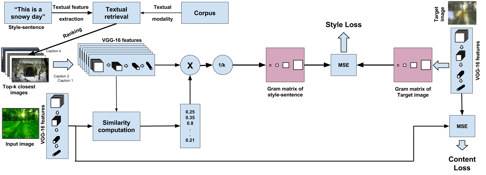

# [WIP] Cross Modal Style Transfer

Code cleanup in Progress. 

We present a method for cross-modal style transfer between an English sentence to an image, to produce a new image that imbibes the essential theme of the sentence. We do this by modifying the style transfer mechanism used in image style transfer to incorporate a style component derived from the given sentence. 

This repo provides PyTorch Implementation of the Cross-Modal-Style transfer paper from:- 

Paper:- https://ieeexplore.ieee.org/document/8451734

## Architecture Diagram

## Dataset

We demonstrate promising results using the YFCC100m dataset - <a href='https://webscope.sandbox.yahoo.com/catalog.php?datatype=i&did=67&guccounter=1&guce_referrer=aHR0cDovL3Byb2plY3RzLmRma2kudW5pLWtsLmRlL3lmY2MxMDBtLz8&guce_referrer_sig=AQAAALot-eUWdiMmyIN9Q0I0llblfIFKY6ts0Vfjwxylf6nI7m6nlsmiHMo7NZn1qQNpvKUAQioJMyZBnqeXeeIz9Ydi2XF3hxAV2uZCKY7avGZREtLFtLsq4oqLzhENYe-ryaCQrM9cWPKO7Kphvpxz2FIEGGjI35wkKZQdVaRuGosR'> link </a>

### Acknowledgement
The code benefits from outstanding prior work and their implementations including:
- [Texture Networks: Feed-forward Synthesis of Textures and Stylized Images](https://arxiv.org/pdf/1603.03417.pdf) by Ulyanov *et al. ICML 2016*. ([code](https://github.com/DmitryUlyanov/texture_nets))
- [Perceptual Losses for Real-Time Style Transfer and Super-Resolution](https://arxiv.org/pdf/1603.08155.pdf) by Johnson *et al. ECCV 2016* ([code](https://github.com/jcjohnson/fast-neural-style)) and its pytorch implementation [code](https://github.com/darkstar112358/fast-neural-style) by Abhishek.
- [Image Style Transfer Using Convolutional Neural Networks](http://www.cv-foundation.org/openaccess/content_cvpr_2016/papers/Gatys_Image_Style_Transfer_CVPR_2016_paper.pdf) by Gatys *et al. CVPR 2016* and its torch implementation [code](https://github.com/jcjohnson/neural-style) by Johnson.
- [Skip-Thought Vectors.](https://arxiv.org/pdf/1506.06726.pdf) by Kiros et al. 
- [Aligning Books and Movies: Towards Story-like Visual Explanations by Watching Movies and Reading Books.](https://arxiv.org/pdf/1506.06724.pdf) by Zhu et al. 
